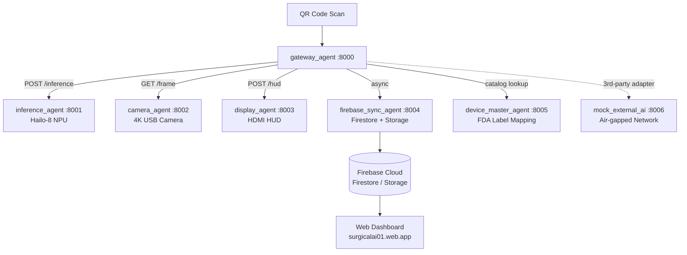

# SurgicalAI01

> Edge AI surgical instrument counting system built on Raspberry Pi 5 + Hailo-8 NPU.
> Multi-agent microservices with real-time Firestore-driven state machine and HDMI HUD overlay.


---

## Overview

SurgicalAI01 is a production-deployed, edge-native surgical tray inspection system. A QR scan triggers an autonomous counting loop: the gateway agent pulls camera frames, runs hardware-accelerated YOLOv8/YOLOv11 inference on the Hailo-8 NPU, evaluates counts against a preset target, and drives an HDMI HUD overlay — all within a Docker Compose microservice mesh running on a Raspberry Pi 5.

Errors automatically trigger asynchronous Firebase Storage snapshot uploads with full Firestore audit trail. A web dashboard (Firebase Hosting) provides admin monitoring and company-facing pass-rate reporting.

**Live deployment**: `https://surgicalai01.web.app`

---

## Architecture



### Network Topology

| Bridge | Subnet | Purpose |
|--------|--------|--------|
| `antigravity_bridge` | `172.20.0.0/16` | Internal service mesh — all Antigravity containers |
| `isolated_ai_bridge` | `172.20.1.0/24` | Air-gapped (`internal: true`) — 3rd-party AI containers |
| `gas_bridge` | `172.21.0.0/16` | Gas cylinder inventory application (separate RPi) |

---

## Agent Roles

| Agent | Container | Port | Responsibility |
|-------|-----------|------|----------------|
| **Gateway** | `gateway_agent` | 8000 | QR decode, state machine (READY → MATCH → ERROR), autonomous counting loop |
| **Inference** | `inference_agent` | 8001 | Hailo-8 NPU inference — YOLOv11 / SurgeoNet (14-class surgical tools) |
| **Camera** | `camera_agent` | 8002 | 4K USB frame capture (internal only) |
| **Display** | `display_agent` | 8003 | HDMI HUD overlay — double-buffered, bounding boxes, status borders |
| **Firebase Sync** | `firebase_sync_agent` | 8004 | Async Firestore history + Storage snapshot upload on error |
| **Device Master** | `device_master_agent` | 8005 | FDA label mapping: `forceps` → `Tissue Forceps, Ring (FDA Class I)` |
| **Mock External AI** | `mock_external_ai` | 8006 | Simulated 3rd-party inference for adapter integration testing |

### State Machine

```
[IDLE] ──QR scan──→ [READY / Yellow] ──count match──→ [MATCH / Green]
                          │                                    │
                     5s mismatch                         auto-advance
                          │                                    │
                          └──────────→ [ERROR / Red] ←─────────┘
                                             │
                                      async snapshot
                                      → Firebase Storage
```

---

## Tech Stack

- **Edge device**: Raspberry Pi 5 (8GB), 64-bit OS
- **AI accelerator**: Hailo-8 M.2 (26 TOPS), PCIe Gen3
- **Models**: YOLOv11 / SurgeoNet (14 surgical instrument classes), CONF_THRESHOLD=0.35
- **Inference runtime**: HailoRT SDK inside Docker (`/dev/hailo0` device passthrough)
- **Orchestration**: Docker Compose, `antigravity_bridge` internal network
- **Backend**: Firebase Firestore (state, audit log), Firebase Storage (error snapshots)
- **Dashboard**: Firebase Hosting — Vanilla JS + Tailwind CSS + Chart.js
- **Language**: Python 3.11, FastAPI, OpenCV
- **Quality**: Ruff (lint/format), Pyright (type check), pytest (TDD)

---

## Quick Start

### Mac (Simulation Mode)

```bash
docker compose -f docker-compose.mac.yml up -d --build
```

### Raspberry Pi 5 + Hailo-8 (Production)

```bash
# 1. Install Hailo-8 driver and Docker
chmod +x scripts/*.sh
./scripts/setup_hailo.sh   # reboot after
./scripts/setup_docker.sh

# 2. Optimize RPi5 performance
./scripts/optimize_rpi5.sh  # reboot after

# 3. Pre-flight check (expect 0 FAILs)
./scripts/check_system.sh

# 4. Launch
docker compose up -d --build
```

### E2E Test (Post-Deploy Verification)

```bash
# Trigger a test job
curl -X POST http://localhost:8000/job \
  -H "Content-Type: application/json" \
  -d '{"job_id":"DEPLOY-TEST-001","target":{"scalpel":1}}'

# Check system health
curl http://localhost:8000/health
curl http://localhost:8001/metrics
```

---

## Manufacturer Integration Layer

SurgicalAI01 includes a production manufacturer catalog integration pipeline for mapping heterogeneous supplier SKUs to SurgeoNet inference class names.

### Semantic SKU Mapper (`scripts/semantic_map_skus.py`)

A two-stage embedding pipeline: multilingual product names are first translated to English (`deep-translator`), then embedded with `all-mpnet-base-v2` for English-to-English cosine similarity. This prevents domain clustering — surgical instruments map to instruments, not to generic medical categories.

| Score Range | Action | Notes |
|---|---|---|
| ≥ 0.60 | AUTO-MAP | High-confidence automatic assignment |
| 0.40–0.60 | REVIEW | Flagged for human review |
| < 0.40 | UNMAPPED | No assignment — needs manual entry |

### Manufacturer Adapters

Three adapters normalize heterogeneous API response schemas to a standard `{sku, name, manufacturer}` format before semantic mapping:

| Adapter | File | Source Language | Notes |
|---|---|---|---|
| Edlo | `adapters/edlo_adapter.py` | Portuguese (PT) | Normalize Edlo product API response |
| Rhosse | `adapters/rhosse_adapter.py` | Portuguese (PT) | Normalize Rhosse product API response |
| Bahadir | `adapters/bahadir_adapter.py` | Turkish / German / English | Multi-language normalization |

---

## Multi-Application Support (`APP_ID`)

The same codebase runs multiple deployments via the `APP_ID` environment variable:

| APP_ID | Application | Network | Notes |
|--------|-------------|---------|-------|
| `surgical` | Surgical instrument counting | `antigravity_bridge` | Primary — RPi5 |
| `inventory_count` | Gas cylinder inventory (Bringel) | `gas_bridge` | Separate RPi, ports 8010/8013 |

---

## Firebase Production Setup

```bash
# Download service account key from Firebase Console
cp ~/Downloads/firebase-service-account.json ./firebase-credentials.json
echo "FIREBASE_CREDENTIALS_PATH=/app/firebase-credentials.json" >> .env
```

---

## Ecosystem Position

SurgicalAI01 is the **primary production edge AI deployment** of the Antigravity platform — deployed in surgical environments, enforcing real-time instrument verification at sub-100ms latency.

```
TeleiosAI01 (Studio)  →  model.hef (SurgeoNet 14-class)
                                      ↓
                         inference_agent (Hailo-8, port 8001)
                                      ↓
QR scan → gateway_agent → camera_agent → inference → display_agent (HDMI)
               │                                            │
               └──────── firebase_sync_agent ───────────────┘
                                   ↓
               Firebase Firestore (audit trail, preset config)
                                   ↓
               AI OD Counter Multitenant (aggregated views)
                                   ↓
               surgicalai01.web.app (admin dashboard)
```

| Role | Project | Connection |
|---|---|---|
| Model factory | [TeleiosAI01](https://github.com/zymer4him2024/teleiosai01) | Produces `model.hef` + `labels.json` consumed by `inference_agent` |
| Count aggregation | [AI OD Counter Multitenant](https://github.com/zymer4him2024/ai-od-counter-multitenant) | Receives per-tenant count events from Firestore |
| Reference architecture | [aiodRPicamera01](https://github.com/zymer4him2024/aiodrpicamera01) | The Orchestrator + agent pattern this system extends with a state machine and HDMI display |
| UI design system | [ui-platform](https://github.com/zymer4him2024/ui-platform) | Design tokens and component patterns for the web dashboard |

---

## Documentation

| Document | Description |
|----------|-------------|
| [CLAUDE.md](./CLAUDE.md) | Agentic OS config — architecture, dev commands, design rules |
| [docs/rpi_onboarding_guide.md](./docs/rpi_onboarding_guide.md) | RPi5 setup and SSH troubleshooting |
| [docs/integration_architecture.md](./docs/integration_architecture.md) | Full system integration spec |
| [docs/3rd_party_ai_inference_spec.md](./docs/3rd_party_ai_inference_spec.md) | 3rd-party AI adapter protocol |
| [docs/customer_api_spec.md](./docs/customer_api_spec.md) | Device Master API reference |
| [GEMINI.md](./GEMINI.md) | Gemini AI context (mirrors CLAUDE.md) |

---

## Engineering Standards

This project enforces SOLID principles, TDD, and container security boundaries.

- **No God classes.** Each agent has exactly one responsibility.
- **No global state leakage** across container boundaries — all inter-agent communication via HTTP on the internal bridge.
- **Async-first** for any I/O that doesn't affect the counting loop (Firebase writes, snapshot uploads).
- **Hardware isolation**: Hailo-8 device access restricted to `inference_agent` via `device_cgroup_rules`.
- Code review authority: **[CLAUDE.md](./CLAUDE.md)**

---

## Harness Engineering

Development on this project is driven by Claude Code with `CLAUDE.md` as the system configuration. The harness encodes:

- **Architecture invariants**: port assignments, network topology, agent responsibilities — violations are flagged as bugs, not trade-offs
- **Module contracts**: each agent's HTTP interface, Docker Compose network isolation, and Hailo-8 device access rules
- **Forbidden patterns**: polling for live data, hardcoded Firebase config, direct Hailo SDK access outside `inference_agent`
- **Quality gates**: Ruff (lint), Pyright (types), pytest (TDD) — all must pass before any task is marked complete
- **Troubleshooting ledger**: 35-entry log of real hardware and software bugs (PCIe detection, HDMI overlay, Hailo SDK SHM) — no bug is ever fixed twice

The 35-entry ledger in [CLAUDE.md](./CLAUDE.md) encodes every non-obvious production issue encountered running real Hailo-8 hardware — from PCIe kernel module quirks to Docker IPC shared memory constraints. Any AI-assisted session starts with this context loaded and enforced.

---

## Platform Resources

| Resource | Description |
|---|---|
| [Platform Overview (TECHNOLOGY.md)](https://github.com/zymer4him2024/ui-platform/blob/main/docs/TECHNOLOGY.md) | Full Antigravity platform narrative — all 8 projects, agentic OS philosophy, harness engineering methodology |
| [Marketing Assets (MARKETING.md)](https://github.com/zymer4him2024/ui-platform/blob/main/docs/MARKETING.md) | Platform positioning, value propositions, competitive analysis, key metrics |
