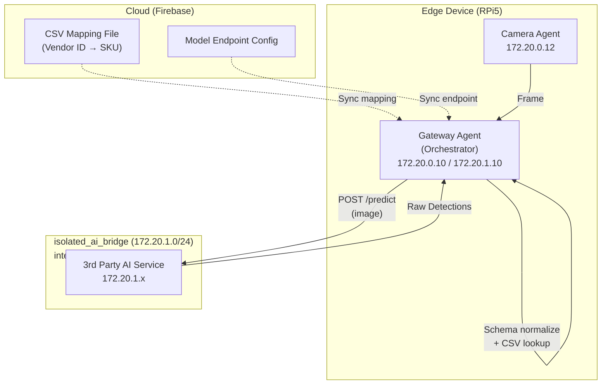

# 3rd Party AI Inference Integration Specification

**Version**: 1.4 (Project Lifecycle, Integration Validation & Header Enforcement)
**Issued by**: Antigravity Surgical AI
**Audience**: AI Model Suppliers / Computer Vision Teams

---

## Overview

This document specifies the HTTP API contract for integrating a 3rd party object detection model into the Antigravity system. The model is integrated as an **edge service** reachable by the Gateway Agent via an air-gapped network.

### Key Architectural Concepts (v1.3)

1. **Gateway Orchestration**: The **Gateway Agent** is the central orchestrator. It manages the connection to your model using configuration fetched from the Digioptics Cloud.
2. **Decoupled Mapping (CSV Flow)**:
   - **Vendor Responsibility**: Output stable, internal "Model Labels" (e.g., `inst_104`). Focus on detection stability.
   - **Customer Responsibility**: Provide a **CSV file** mapping your `inst_104` to their internal SKU (e.g., `Mayo_SC_05`).
   - **Gateway Responsibility**: Perform the lookup and translate raw IDs into the final display names for the HUD.
3. **Size-Based Differentiation (`inst-104` vs `inst-105`)**: If two instruments have the same shape but different sizes:
   - **Model Responsibility**: Differentiate them into unique raw labels (e.g., `inst_104_small` vs `inst_105_large`) based on pixel area or aspect ratio.
   - **Reference Scale**: The camera has a **fixed focal length and mounting distance**, so pixel dimensions (`width` x `height`) are a direct proxy for physical size.
   - **Gateway Filter**: The Gateway Agent can apply an optional **Dimension Filter** (stored in the cloud config) to validate that `inst_104` detections fall within an expected pixel-size range.
4. **Identity Tracking**: Every request includes headers (`X-App-ID`, `X-Device-ID`) for domain and station isolation.
5. **Network Isolation**: 3rd party containers are deployed on an air-gapped internal network (`isolated_ai_bridge`). They have no outbound internet access. The Gateway Agent is dual-homed and is the only path in or out.
6. **Schema Normalization**: The Gateway contains an adapter layer (`_normalize_inference_response`) that translates your response schema into the internal format. You are not required to match our native inference schema.

---

## Integration Architecture



### Network Isolation Details

| Network | Subnet | Access |
|---|---|---|
| `antigravity_bridge` | `172.20.0.0/16` | All Antigravity containers. Internet-accessible. |
| `isolated_ai_bridge` | `172.20.1.0/24` | 3rd party AI only. `internal: true` — no outbound internet. |

The Gateway Agent is dual-homed (`172.20.0.10` on `antigravity_bridge`, `172.20.1.10` on `isolated_ai_bridge`) and is the **only** bridge between the two networks.

**3rd party containers must be assigned exclusively to `isolated_ai_bridge`.** Assignment to `antigravity_bridge` will be rejected during code review.

---

## API Specification

### 1. Inference Endpoint: `POST /predict`

Your service must expose a RESTful endpoint. The exact path is configurable in our Cloud Dashboard (default: `/predict`).

#### Request Headers

| Header | Required | Description |
|---|---|---|
| `Authorization` | Yes | Bearer token or API key provided in our Cloud Dashboard. |
| `X-App-ID` | Yes | Domain ID: `surgical` \| `od` \| `inventory` \| `inventory_count`. |
| `X-Device-ID` | Yes | Unique station ID (e.g., `rpi-001`). |
| `Content-Type` | Yes | `multipart/form-data` |

#### Request Body (form-data)

| Parameter | Type | Required | Description |
|---|---|---|---|
| `image` | File (Binary) | Yes | Image in JPEG format. |

#### Response (200 OK)

```json
{
  "success": true,
  "inference_ms": 42.0,
  "device_temp_c": 65.5,
  "items": [
    {
      "label": "inst_104",
      "score": 0.98,
      "box": [100, 200, 50, 150]
    }
  ]
}
```

**Field Definitions**:

| Field | Type | Required | Description |
|---|---|---|---|
| `success` | boolean | Yes | Set to `false` on internal model errors. |
| `inference_ms` | float | Yes | Latency of the model inference only. |
| `device_temp_c` | float | No | Optional: NPU/GPU temperature for thermal throttle monitoring. |
| `items` | array | Yes | List of detected objects. Empty array if none detected. |
| `items[].label` | string | Yes | **Raw Model Label** (matched to the CSV mapping). |
| `items[].score` | float | Yes | Confidence score (0.0 to 1.0). |
| `items[].box` | array[int] | Yes | Bounding box: `[x_min, y_min, width, height]` in pixels. |

#### Gateway Schema Normalization

The Gateway's `_normalize_inference_response` adapter detects the 3rd party schema by checking for the `"success"` + `"items"` keys and translates it to the internal format:

```
items[].label   → detections[].class_name
items[].score   → detections[].confidence
items[].box     → detections[].bbox
inference_ms    → inference_time_ms
device_temp_c   → npu_temp_celsius
```

You do not need to change your schema to match the native inference agent format. The adapter handles the translation.

### 2. Health Endpoint: `GET /health`

```json
{
  "status": "ok",
  "model_loaded": true,
  "version": "1.0.0"
}
```

The Gateway calls this endpoint to verify reachability before activating a counting job.

---

## Scale Calibration

The Edge Device uses a fixed-distance camera mount. You can assume a constant **Pixels-per-Millimeter (PPM)** ratio once calibrated. We will provide the height (mm) of our standard workspace to help differentiate instruments based on absolute physical size.

---

## Performance SLA

| Metric | Requirement | Notes |
|---|---|---|
| **P95 Latency** | < 120ms | Includes networking between Gateway and AI container. |
| **Throughput** | 10 FPS | Recommended minimum for smooth HUD overlay. |

---

## Manufacturer SKU Catalog Integration

For customers who need to map their existing instrument inventory (by manufacturer SKU) to AI detection classes, we provide a two-stage catalog pipeline.

### Stage 1: Manufacturer Adapters

Each adapter fetches the manufacturer's product catalog via their API and normalizes it to a common format:

```json
[
  { "sku": "ED-102", "name": "Tesoura Metzenbaum Curva 14cm", "manufacturer": "Edlo" },
  { "sku": "RHO-44", "name": "Pinça Cirúrgica Dente de Rato 14cm", "manufacturer": "Rhosse" },
  { "sku": "BAH-11", "name": "Metzenbaum Makas 18cm Egri", "manufacturer": "Bahadir" }
]
```

| Adapter | File | Manufacturer | Language |
|---|---|---|---|
| Edlo | `adapters/edlo_adapter.py` | Edlo (Brazil) | Portuguese |
| Rhosse | `adapters/rhosse_adapter.py` | Rhosse (Brazil) | Portuguese |
| Bahadir | `adapters/bahadir_adapter.py` | Bahadir (Turkey) | Turkish / German / English |

**Usage:**
```bash
export EDLO_API_KEY=your_key_here
python3 adapters/edlo_adapter.py              # writes catalogs/edlo.json
python3 adapters/edlo_adapter.py --dry-run   # preview only
```

### Stage 2: Semantic SKU Mapper

`scripts/semantic_map_skus.py` maps catalog names (in any supported language) to the 14 SurgeoNet detection classes using a two-stage embedding pipeline:

1. **Translate**: Each product name is translated to English via `deep-translator`.
2. **Embed**: The translated English name is embedded using `all-mpnet-base-v2`.
3. **Match**: Cosine similarity against per-class anchor descriptions (EN + PT + TR/DE).

**Thresholds:**

| Score | Decision |
|---|---|
| `≥ 0.60` | **Auto-mapped** — written to `data/sku_mapping.json` |
| `0.40 – 0.59` | **Review queue** — flagged for human confirmation |
| `< 0.40` | **Unmapped** — instrument class not recognized |

**Output format (`data/sku_mapping.json`):**
```json
{
  "auto_mapped": {
    "ED-102": {
      "class": "Metz. Scissor",
      "score": 0.94,
      "name": "Tesoura Metzenbaum Curva 14cm",
      "manufacturer": "Edlo"
    }
  },
  "review_queue": [...],
  "unmapped": [...]
}
```

**Usage:**
```bash
# Map a catalog, merge into existing mapping (non-destructive)
python3 scripts/semantic_map_skus.py \
  --input catalogs/edlo.json \
  --merge data/sku_mapping.json \
  --threshold-auto 0.60 \
  --threshold-review 0.40

# Demo mode (uses built-in Rhosse/Edlo/Bahadir samples)
python3 scripts/semantic_map_skus.py --demo
```

---

## Mock Service for Integration Testing

A `mock_external_ai` container (`172.20.1.16:8006`) is included in `docker-compose.yml` to test the Gateway adapter layer without a real AI model.

- Uses the same `POST /predict` + `GET /health` contract specified above.
- Returns randomized detections (1–3 items from `scalpel`, `forceps`, `scissors`) with 40–80ms simulated latency.
- Useful for verifying that schema normalization, bounding box overlay, and state machine transitions work end-to-end before your model is ready.

```bash
# Run simulation mode (no real Hailo hardware needed)
docker compose -f docker-compose.mac.yml up -d --build

# Verify mock AI is reachable via Gateway
curl http://localhost:8000/health
```

### Integration Validation Endpoint (v1.4)

The mock service provides a `GET /integration/validate` endpoint that vendors can call to verify their header setup is correct **before** testing with real inference.

```bash
curl -H "X-App-ID: surgical" \
     -H "X-Device-ID: rpi-001" \
     -H "Authorization: Bearer YOUR_TOKEN" \
     http://172.20.1.16:8006/integration/validate
```

**Response (200 OK)**:
```json
{
  "valid": true,
  "checks": {
    "x_app_id":      { "present": true,  "value": "surgical" },
    "x_device_id":   { "present": true,  "value": "rpi-001" },
    "authorization":  { "present": true,  "scheme": "Bearer" }
  }
}
```

If any header is missing, `valid` will be `false` and the corresponding `present` field will be `false`.

---

## Implementation Checklist

- [ ] **Dockerized**: Service must run as a Docker container assigned exclusively to `isolated_ai_bridge`.
- [ ] **Non-root user**: Container must run as a non-root user with `mem_limit` and `cpus` set.
- [ ] **Stability**: Raw labels must remain consistent across model updates to avoid breaking CSV mappings.
- [ ] **Health Check**: Expose `GET /health` returning `{"status": "ok", "model_loaded": true}`.
- [ ] **Response Schema**: Response must include `success`, `inference_ms`, and `items[]` with `label`, `score`, `box` fields.
- [ ] **No internet access**: Container must not require outbound internet access at inference time.
- [ ] **Integration test**: Verify end-to-end with `scripts/test_3rdparty_integration.py` before production deployment.
