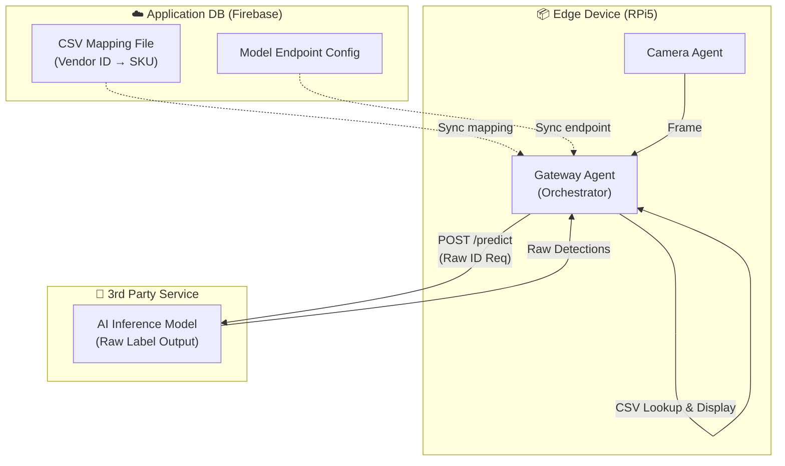

# 3rd Party AI Inference Integration Specification

**Version**: 1.2 (CSV Mapping & Multitenant)  
**Issued by**: Antigravity Surgical AI  
**Audience**: AI Model Suppliers / Computer Vision Teams  

---

## Overview

This document specifies the HTTP API contract for integrating a 3rd party object detection model into the Antigravity system. The model is integrated as an **edge service** reachable by the Gateway Agent.

### Key Architectural Concepts (v1.2)

1. **Gateway Orchestration**: The **Gateway Agent** is the central orchestrator. It manages the connection to your model using configuration fetched from the Digioptics Cloud.
2. **Decoupled Mapping (CSV Flow)**: 
   - **Vendor Responsibility**: Output stable, internal "Model Labels" (e.g., `inst_104`). Focus on detection stability.
   - **Customer Responsibility**: Provide a **CSV file** mapping your `inst_104` to their internal SKU (e.g., `Mayo_SC_05`).
   - **Gateway Responsibility**: Perform the lookup and translate raw IDs into the final display names for the HUD.
3. **Size-Based Differentiation (`inst-104` vs `inst-105`)**
If two instruments have the same shape but different sizes:
- **Model Responsibility**: The AI model should ideally differentiate them into unique raw labels (e.g., `inst_104_small` vs `inst_105_large`) based on pixel area or aspect ratio.
- **Reference Scale**: Since our camera has a **fixed focal length and mounting distance**, pixel dimensions (`width` x `height` in the bounding box) are a direct proxy for physical size. 
- **Gateway Filter**: Our Gateway Agent can apply an optional **Dimension Filter** (stored in the cloud config) to validate that `inst_104` detections fall within an expected pixel-size range.
4. **Identity Tracking**: Every request includes headers (`X-App-ID`, `X-Device-ID`) for domain and station isolation.

---

## Integration Architecture



---

## API Specification

### 1. Inference Endpoint: `POST /predict`

Your service must expose a RESTful endpoint. The exact path is configurable in our Cloud Dashboard.

#### Request Headers

| Header | Required | Description |
|---|---|---|
| `Authorization` | ✅ | Bearer token or API key provided in our Cloud Dashboard. |
| `X-App-ID` | ✅ | Domain ID: `surgical` \| `od` \| `inventory`. |
| `X-Device-ID` | ✅ | Unique station ID (e.g., `rpi-001`). |
| `Content-Type` | ✅ | `multipart/form-data` |

#### Request Body (form-data)

| Parameter | Type | Required | Description |
|---|---|---|---|
| `image` | File (Binary) | ✅ | Image in JPEG format. |

#### Response (200 OK)

```json
{
  "success": true,
  "inference_ms": 42.0,
  "items": [
    {
      "label": "inst_104",
      "score": 0.98,
      "box": [100, 200, 50, 150]
    }
  ]
}
```

**Field Definitions**:

| Field | Type | Required | Description |
|---|---|---|---|
| `success` | boolean | ✅ | Set to `false` on internal model errors. |
| `inference_ms` | float | ✅ | Latency of the model inference only. |
| `items` | array | ✅ | List of detected objects. |
| `items[].label`| string | ✅ | **Raw Model Label** (matched to the CSV mapping). |
| `items[].score`| float | ✅ | Confidence score (0.0 to 1.0). |
| `items[].box`  | array[int] | ✅ | Bounding box: `[x_min, y_min, width, height]`. |

## 4. Scale Calibration
Because the Edge Device uses a fixed-distance camera mount, you can assume a constant **Pixels-per-Millimeter (PPM)** ratio once calibrated. We will provide the height (mm) of our standard workspace to your team to help differentiate `inst-104` from `inst-105` based on absolute physical size.

---

## Performance SLA

| Metric | Requirement | Notes |
|---|---|---|
| **P95 Latency** | < 120ms | Includes networking between Gateway and AI container. |
| **Throughput** | 10 FPS | Recommended minimum for smooth HUD overlay. |

---

## Implementation Checklist

- [ ] **Dockerized**: Service must run as a Docker container on the `antigravity_bridge`.
- [ ] **Stability**: Raw labels must remain consistent across model updates to avoid breaking CSV mappings.
- [ ] **Health Check**: Provide a `GET /health` endpoint.
