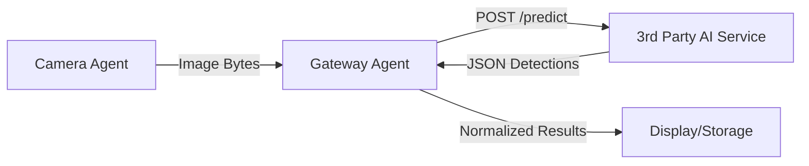

# 3rd Party AI Inference Integration Specification

**Version**: 1.0  
**Issued by**: Antigravity Surgical AI  
**Audience**: AI Model Suppliers / Computer Vision Teams  

---

## Overview

This document specifies the HTTP API contract required for integrating a 3rd party object detection model into the Antigravity Surgical AI system. The model must be deployed as an edge service (typically on the Raspberry Pi 5) reachable via the internal network.

The **Gateway Agent** acts as a client, sending images to your service and expecting standardized detection results in return.

---

## Integration Architecture



---

## API Specification

### 1. Inference Endpoint: `POST /predict` (or `/inference`)

The model supplier must provide a RESTful endpoint that accepts an image and returns a list of detected surgical instruments.

#### Request

| Parameter | Location | Type | Required | Description |
|---|---|---|---|---|
| `image` | Body (form-data) | File (Binary) | ✅ | Image in JPEG or PNG format |

**Headers**:
- `Content-Type: multipart/form-data`

#### Response (200 OK)

The response MUST follow this structure (or a compatible one that can be mapped via our adapter):

```json
{
  "success": true,
  "processing_time_ms": 45.2,
  "items": [
    {
      "label": "forceps",
      "score": 0.985,
      "box": [102, 240, 50, 180]
    },
    {
      "label": "scalpel",
      "score": 0.952,
      "box": [300, 150, 40, 150]
    }
  ],
  "device_temp_c": 68.5
}
```

**Field Definitions**:

| Field | Type | Required | Description |
|---|---|---|---|
| `success` | boolean | ✅ | Whether inference was successful |
| `processing_time_ms` | float | ✅ | Time taken for model inference only |
| `items` | array | ✅ | List of detected objects |
| `items[].label` | string | ✅ | Class name (e.g., "forceps") |
| `items[].score` | float | ✅ | Confidence score (0.0 to 1.0) |
| `items[].box` | array[int] | ✅ | Bounding box: `[x_min, y_min, width, height]` |
| `device_temp_c` | float | ❌ | Current AI accelerator temperature |

---

## Performance Requirements

To ensure real-time performance on the HDMI HUD, the 3rd party service must meet the following SLAs:

| Metric | Requirement | Target |
|---|---|---|
| **Latency (Inference)** | < 100ms | 50ms |
| **Throughput** | > 10 FPS | 15 FPS |
| **Stability** | 99.9% | No memory leaks over 24h operation |

---

## Implementation Checklist

- [ ] Wrap model in a lightweight FastAPI/Flask container.
- [ ] Expose `POST` endpoint as specified above.
- [ ] Ensure model labels match the agreed-upon [Class Mapping Schema](device_master_catalog_spec.md).
- [ ] Configure `docker-compose` to run the service on the `antigravity_bridge` network.

---

## Contact

For technical integration support: Antigravity Surgical AI Dev Team.
