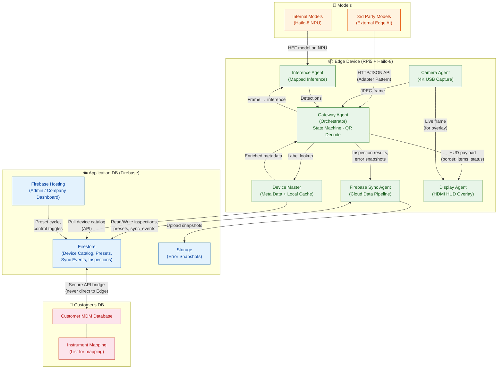
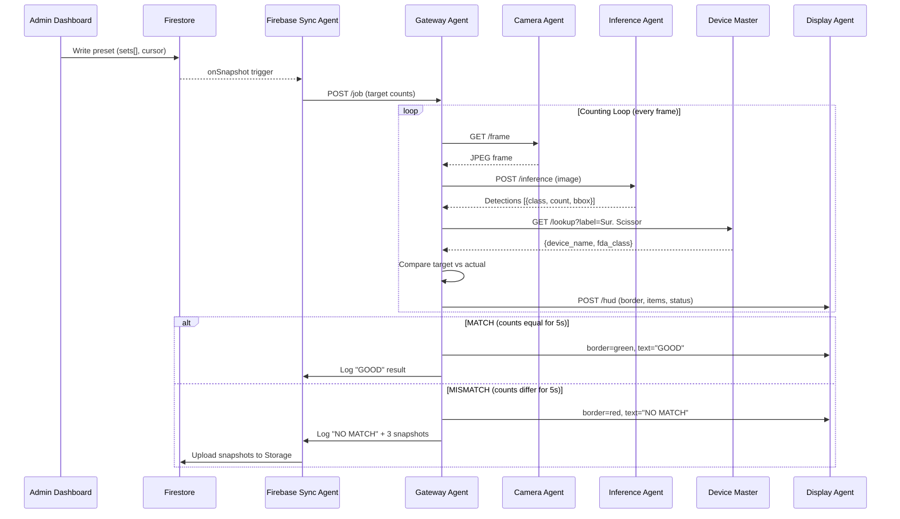

# Teleios Gateway — System Architecture

## Updated Architecture Diagram

## Key Differences from Original Diagram

| Area | Original | Updated |
|---|---|---|
| **Gateway Agent** | Missing — inference was shown as the central node | Added as the orchestrator hub that coordinates all agents |
| **Firebase Sync Agent** | Missing | Added — handles all cloud data upload/download |
| **Meta Data** | Two ambiguous "Meta Data" boxes | Clarified: **Firestore** (cloud catalog) and **Device Master** (local cache) |
| **Customer DB → Edge** | Direct path unclear | Made explicit: Customer DB → App DB → Device Master (never direct) |
| **Display ↔ Camera** | Bidirectional arrow | Corrected: Camera sends frames to Gateway AND Display; Display never calls Camera |
| **QR Scanner** | Not shown | Included as part of Gateway Agent responsibilities |

## Data Flow Summary

