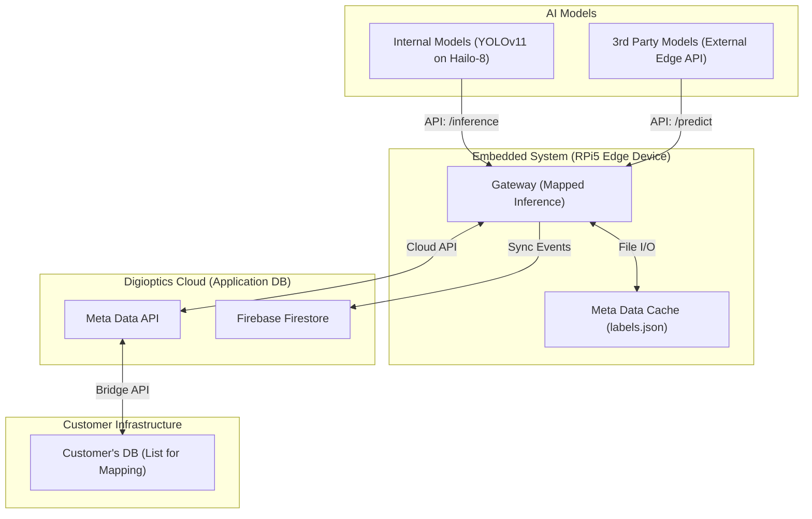

# System Integration Architecture: The "Standardized Bridge"

This document formalizes the high-level data flow and integration architecture of the Antigravity Surgical AI system, bridging the AI Model providers (3rd Party/Internal) and the Customer's Data Infrastructure.

## 1. System Topology

As per your conceptual diagram, here is the technical mapping of the data flow:

## 2. Document Alignment Matrix

Your integration strategy is supported by three primary documentation pillars:

| Component in Diagram | Technical Name | Supporting Document |
|---|---|---|
| **3rd Party Models** | External Inference | [3rd Party AI Inference Spec](3rd_party_ai_inference_spec.md) |
| **Digioptics DB (Application DB)** | Digioptics Cloud API | [Web Dashboard Implementation](https://surgicalai01.web.app) |
| **Customer DB** | Hospital MDM System | [Customer Device Master API](customer_api_spec.md) |
| **Mapped Inference** | Edge Device Gateway | [Main Controller Logic](../src/gateway/main.py) |

## 3. Data Flow Rationale

1.  **AI Models**: Provide "raw" intelligence (e.g., Detecting location `[x,y]` and class `scissors`).
2.  **Mapped Inference (Edge Device)**: The Edge Gateway receives raw detections. It utilizes caching and calls the **Digioptics Application DB** (Meta Data API) to translate the raw labels into mapped endpoints.
3.  **Digioptics Application DB**: Acts as the intermediary broker. It securely polls or syncs with the **Customer's DB** to maintain an up-to-date catalog mapping. The Edge Device never touches the Customer DB directly.
4.  **Customer's DB**: Provides the "List for Mapping" securely to the Digioptics Cloud (e.g., standardizing that `scissors` means `Precision Dissecting Scissor, Curved`).

## 4. Why this matters for Architecture Security
- **Security Isolation**: The Edge Device is physically isolated from the Customer's internal network DB. It only talks to the Digioptics Cloud.
- **Vendor Agnostic**: You can swap models on the left without touching the database schema on the right.
- **Fail-Safe**: If internet connectivity drops, the Edge Device falls back to its local Meta Data Cache (labels.json) seamlessly.
- **Scalable**: Adding a new instrument only requires updating the "List for Mapping" in the DB, syncing it to the Application DB.
