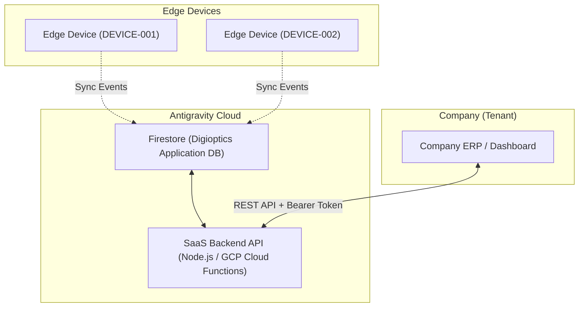

# SaaS Backend API for Companies — Integration & Management Specification

**Version**: 1.0  
**Issued by**: Antigravity Surgical AI  
**Audience**: SaaS Tenants (Hospitals, Inventory Mgmt Corporations), Internal Integration Developers  

---

## 1. Overview

The **Antigravity SaaS Backend API** provides a RESTful interface for our enterprise customers ("Companies") to securely access their inspection data, manage edge devices, and configure multi-tenant environments. 

This API sits on top of the **Digioptics Application DB** (powered by Firebase/GCP) and exposes standard HTTP endpoints so that a Company's internal ERP or analytics system can automatically pull data without manual export from the web dashboard.

---

## 2. Architecture & Multitenancy

Our SaaS platform relies on two primary segregation keys:
- `APP_ID`: The vertical solution (e.g., `surgical`, `inventory_count`, `od`).
- `COMPANY_ID`: The unique enterprise tenant identifier.



---

## 3. Authentication & Security

All endpoints require a secure **Server-to-Server API Key** or **JWT Bearer Token** provisioned via the Antigravity Admin Console.

- **Header**: `Authorization: Bearer <COMPANY_API_TOKEN>`
- **Rate Limiting**: 100 requests per minute per `COMPANY_ID`.
- **Data Isolation**: A token is strictly scoped to a single `COMPANY_ID`. Any attempt to access another company's data returns `403 Forbidden`.

---

## 4. Core Endpoints

### 4.1. List Company Devices
Retrieves the fleet status of all Edge Devices registered to the company.

- **Endpoint**: `GET /api/v1/companies/{company_id}/devices`
- **Parameters**: 
  - `status` (optional): Filter by `online` or `offline`.

**Response (200 OK):**
```json
{
  "company_id": "C-10023",
  "devices": [
    {
      "device_id": "SURG-RPi-001",
      "app_id": "surgical",
      "status": "online",
      "last_health_check": "2026-03-26T12:00:00Z",
      "location": "OR-1"
    }
  ]
}
```

### 4.2. Fetch Inspection / Counting Logs
Retrieves the historical log of completed inspections or inventory counts.

- **Endpoint**: `GET /api/v1/companies/{company_id}/logs`
- **Parameters**:
  - `app_id` (required): `surgical` | `inventory_count`
  - `start_time` (required): ISO8601 Timestamp
  - `end_time` (required): ISO8601 Timestamp
  - `limit` (optional): Default 100, Max 500

**Response (200 OK):**
```json
{
  "logs": [
    {
      "log_id": "log_8x9a2",
      "device_id": "SURG-RPi-001",
      "job_id": "TRAY-001",
      "timestamp": "2026-03-26T14:30:00Z",
      "result": "GOOD",
      "detected_items": {
        "scalpel": 1,
        "forceps": 2
      }
    }
  ],
  "next_page_token": "page_2_token"
}
```

### 4.3. Update Device Configuration (Presets)
Pushes new job configurations or target JSON prescriptions to a specific edge device.

- **Endpoint**: `POST /api/v1/companies/{company_id}/devices/{device_id}/config`
- **Content-Type**: `application/json`

**Request Body:**
```json
{
  "job_id": "TRAY-NEW-2026",
  "target": {
    "scissors": 1,
    "clamp": 3
  }
}
```

**Response (202 Accepted):**
```json
{
  "status": "queued",
  "message": "Configuration queued for Edge Device sync."
}
```

---

## 5. Webhook Integration (Event Driven)

Instead of polling `GET /logs`, companies can register a Webhook URL to receive instant POST notifications when critical events occur (e.g., `ERROR` mismatch lasting >5 seconds, or `LOW_STOCK` triggering on gas cylinders).

### Webhook Payload Example:
```json
{
  "event_type": "inspection_error",
  "company_id": "C-10023",
  "device_id": "SURG-RPi-001",
  "timestamp": "2026-03-26T15:00:00Z",
  "data": {
    "job_id": "TRAY-002",
    "expected": {"scalpel": 2},
    "actual": {"scalpel": 1},
    "snapshot_urls": [
      "https://storage.googleapis.com/.../snap1.jpg"
    ]
  }
}
```

---

## 6. Implementation Checklist & Migration
- [ ] Generate Company API Tokens via Antigravity Dashboard.
- [ ] Whitelist Customer IP ranges (Optional but recommended).
- [ ] Integrate GET endpoints into Customer ERP for automated reporting.
- [ ] Configure Webhooks for real-time alerting systems.
